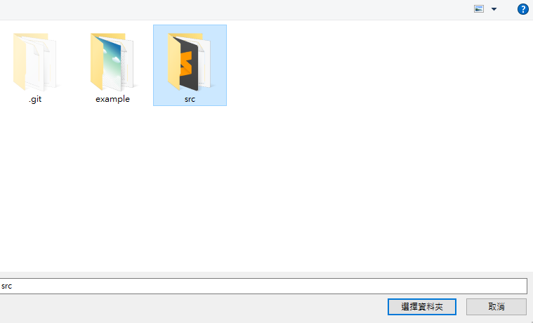

## 安裝說明

#### 1.下載原始碼 <a href="https://github.com/colindev/chrome-app-rename/releases" target="_blank">source</a>
---

#### 2.打開擴充功能頁面 - chrome://extensions
---

#### 3.啟用開發人員模式
---

> 打開開發人員模式開關

#### 4.從原始碼安裝 Chrome App
---

> 點選 "載入為封裝項目" 按鈕

> 選取 src 資料夾

#### 5.啟動 Chrome App - chrome://apps
---

> 點選 Rename App icon 啟動

