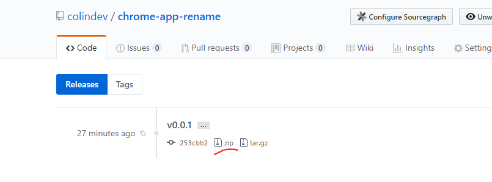
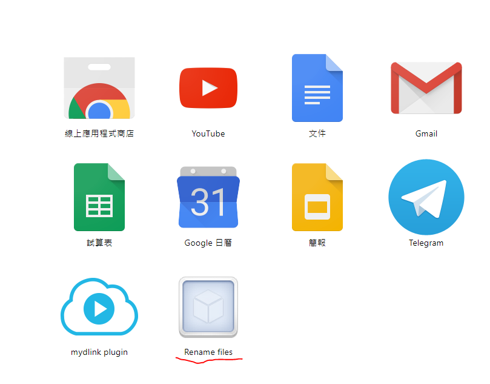

## 安裝說明

===
#### 下載原始碼 <a href="https://github.com/colindev/chrome-app-rename/releases" target="_blank">source</a>

===
#### 打開擴充功能頁面 <a href="chrome://extensions/" target="_blank">擴充功能</a>

===
#### 啟用開發人員模式

===
#### 從原始碼安裝 Chrome App

===
#### 啟動 Chrome App <a href="chrome://apps/" target="_blank">Chrome Apps</a>

